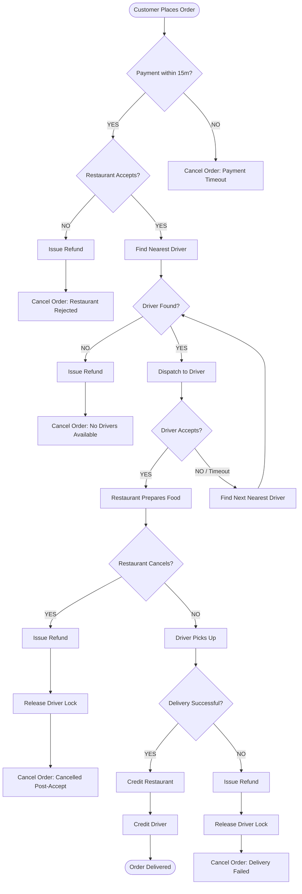
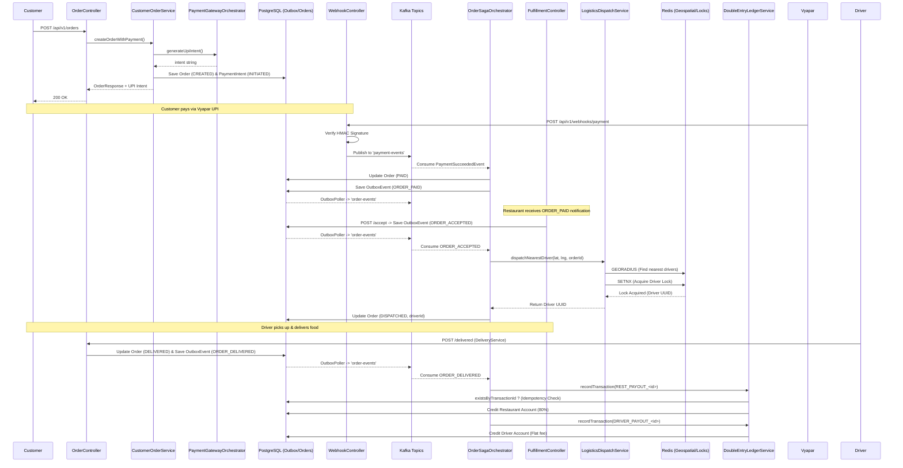
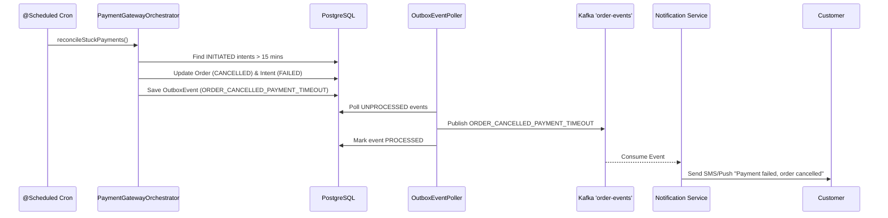
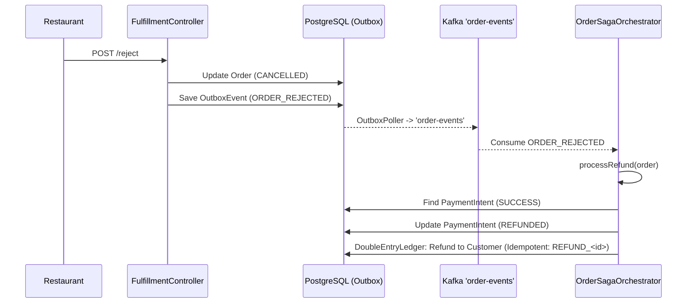
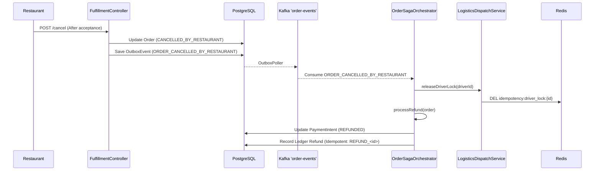
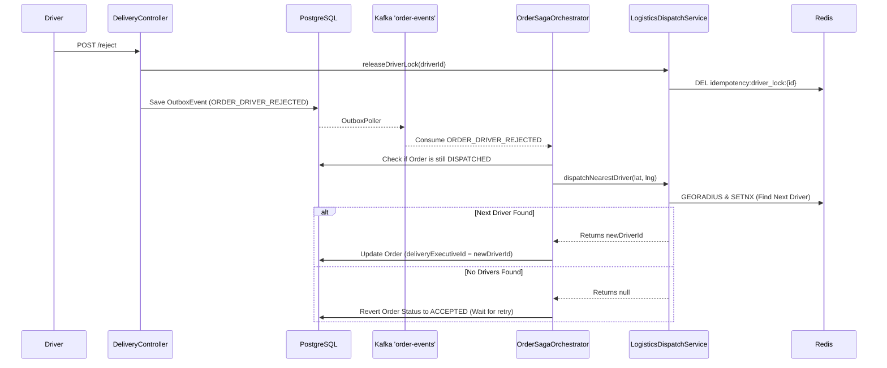
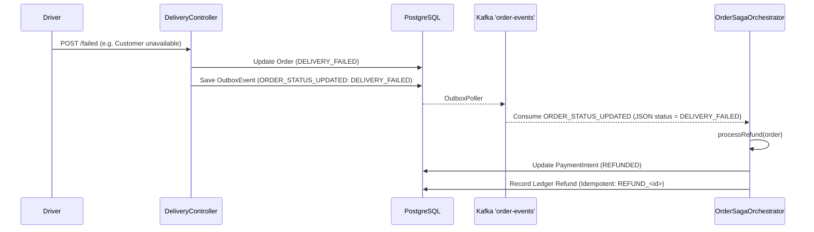
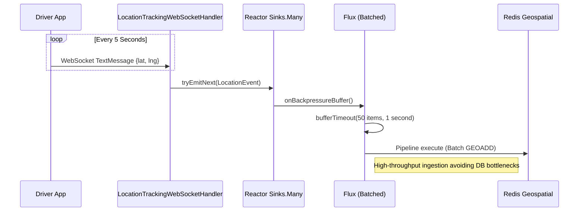
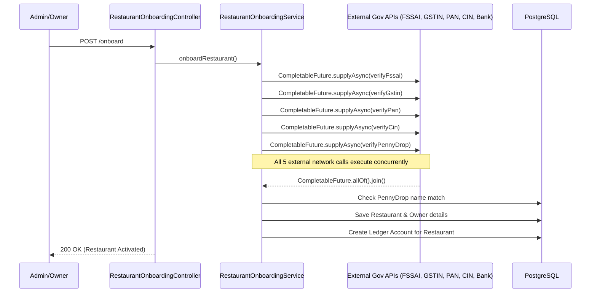

# Code Flow & Architecture Guide

This document describes the architectural patterns used in the Food Delivery ecosystem, now unified into a single Modular Monolith.

## 1. Backend Architecture (Modular Monolith)

The backend has been refactored from scattered microservices into a highly cohesive **Modular Monolith** running on Java 21 and Spring Boot 3.3.0. This simplifies deployment while maintaining strict domain boundaries.

The codebase is organized under `com.fooddelivery`:
- **`common`**: Contains shared DTOs (`ApiResponse`), custom exceptions, and core infrastructure filters like `IdempotencyFilter` (Redis locking), `RateLimitingService` (Bucket4j), `RequestCachingFilter` (Webhook validation), and `NotificationRouterService` (Kafka).
- **`customer`**: Manages auth (`AuthController`), location discovery (`PlacesController`), restaurant search via PostGIS `ST_DWithin` (`CustomerRestaurantController`), and cart/order initiation (`OrderController`).
- **`restaurant`**: Manages KYB onboarding via mocked external verifications (`RestaurantOnboardingService`), catalog (`CatalogController`), and kitchen fulfillment (`FulfillmentService`).
- **`delivery`**: Manages fleet availability (`DeliveryExecutiveController`), algorithmic nearest-driver dispatch with atomic Redis locks (`LogisticsDispatchService`), routing (`LogisticsController`), and reactive WebSocket real-time telemetry using Project Reactor Sinks and Redis Geospatial (`LocationTrackingWebSocketHandler`).
- **`order`**: Orchestrates distributed Saga transactions (`OrderSagaOrchestrator`), Outbox pattern implementation, Ledger immutable double-entry accounting with optimistic locking (`LedgerService`), and Vyapar constant-time HMAC webhook validation (`WebhookController`).

**Key Engineering Standards:**
- **Repository Interfaces**: All Spring Data JPA repository interfaces must begin with an uppercase `I` (e.g., `ICustomerRepository`, `IOrderRepository`).
- **Database Migrations**: The database schema is initialized using Flyway. All initial tables and production indexes are squashed into a single `V1__init_schema.sql` file.
- **Production Hardening**: The system uses HikariCP for connection pooling, explicit transaction boundaries, and strict Redis connection lifecycle management to prevent leaks under load.
- **Kafka Listener Exception Handling**: Kafka `@KafkaListener` methods must NEVER silently catch and swallow exceptions. They must log and rethrow exceptions (e.g., as `RuntimeException`) to ensure the Spring Kafka container registers the failure, enabling redelivery retries and DLQ routing.
- **Transaction Proxy Bypass**: AOP proxy bypass issues must be avoided. Methods annotated with `@Transactional` cannot be called internally from within the same bean (self-invocation), as the proxy is bypassed and the transaction is ignored. Logic must be inlined or properly routed.
- **Onboarding Requirements**: The `RestaurantOnboardingService` mandates a "Penny Drop" mock verification. The `bankAccountNumber` and `ifscCode` fields are REQUIRED in the JSON payload when hitting the `POST /api/v1/restaurants/onboard` endpoint (returns `400 Bad Request` otherwise).
- **Test Isolation**: E2E tests MUST clear the Redis geospatial index (`DRIVER_LOCATION_KEY`) before running (e.g., using `redis-cli FLUSHALL`) to prevent cross-test driver dispatching conflicts where orders get assigned to drivers left over from previous test runs.

### 1.1 The Transactional Outbox Pattern
To ensure atomic database updates and Kafka event emissions:
1. When domain services (like `CustomerOrderService` or `FulfillmentService`) mutate state, they synchronously insert an event into the `outbox_events` table within the same `@Transactional` boundary using `OrderSagaOrchestrator.saveStateAndEvent()`.
2. A scheduled `OutboxEventPublisher` polls this table.
3. It publishes events to Kafka and deletes the row upon success.

### 1.2 Saga Orchestration & Financial Ledger
1. **Order Creation**: Order is saved (Status: `CREATED`). Outbox event is emitted.
2. **Webhook/Payment Integration**: `WebhookController` handles callbacks, validating HMAC signatures in constant-time.
3. **Logistics Dispatch**: `LogisticsDispatchService` is triggered, utilizing `opsForGeo().radius()` and atomic `setIfAbsent` on Redis to find and lock a delivery executive. This lock has a TTL of 15 minutes.
4. **Kitchen Acceptance**: `FulfillmentService` changes status to `ACCEPTED` and triggers logistics flow via Outbox.
   * If the restaurant cancels *after* acceptance, status becomes `CANCELLED_BY_RESTAURANT`, and any active driver locks are released.
5. **Logistics Completion**: Driver completes delivery (`DELIVERED`) or fails (`DELIVERY_FAILED`). This sets the driver back to `ONLINE` and releases the Redis lock (`driver_lock:{driverId}`) allowing new assignments. Ping timeouts also release the driver lock.
6. **Ledger**: The `LedgerService` uses optimistic locking (`@Version`) to safely credit and debit the restaurant/driver accounts asynchronously.

# Comprehensive System Flow Diagrams

This document contains detailed sequence diagrams for every major scenario within the Food Delivery Application backend.

## Order Saga Decision Flowchart

## 1. Happy Path: E2E Order to Delivery Flow

## 2. Order Cancellation: Payment Timeout (Cron Job)

## 3. Restaurant Rejection & Refund Flow

## 4. Restaurant Cancellation Post-Acceptance

## 5. Driver Rejection & Redispatch Flow

## 6. Delivery Failed Flow

## 7. Reactive Delivery Telemetry Ingestion (WebSockets)

## 8. Parallelized Restaurant Onboarding Flow

## 2. Frontend Architecture (Flutter)
*(Note: As per requirements, UI implementation was paused, but the target architecture remains MapLibre GL with reactive Provider state and SQLite offline buffering for resilient tracking).*
