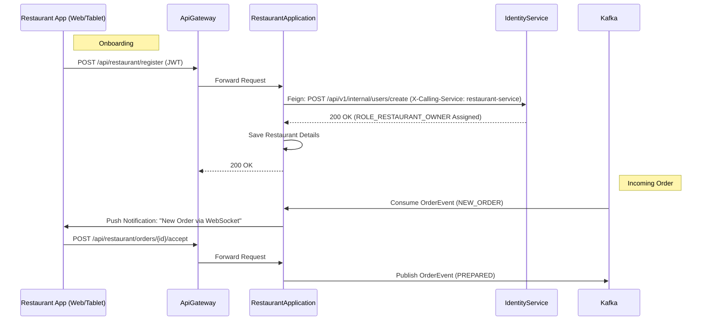

# RestaurantApplication Architecture

This service acts both as an upstream data provider for Customer discovery and a downstream fulfillment engine.

## Detailed Sequence Diagram

```mermaid
sequenceDiagram
    participant OwnerClient as Restaurant App (Web/Tablet)
    participant ApiGateway
    participant RestaurantApp as RestaurantApplication
    participant IdentityApp as IdentityService
    participant Kafka

    %% Registration Flow
    note right of OwnerClient: Onboarding
    OwnerClient->>ApiGateway: POST /api/restaurant/register (JWT)
    ApiGateway->>RestaurantApp: Forward Request
    RestaurantApp->>IdentityApp: Feign: POST /api/v1/internal/users/create (X-Calling-Service: restaurant-service)
    IdentityApp-->>RestaurantApp: 200 OK (ROLE_RESTAURANT_OWNER Assigned)
    RestaurantApp->>RestaurantApp: Save Restaurant Details
    RestaurantApp-->>ApiGateway: 200 OK
    
    %% Fulfillment Flow
    note right of Kafka: Incoming Order
    Kafka->>RestaurantApp: Consume OrderEvent (NEW_ORDER)
    RestaurantApp->>OwnerClient: Push Notification: "New Order via WebSocket"
    OwnerClient->>ApiGateway: POST /api/restaurant/orders/{id}/accept
    ApiGateway->>RestaurantApp: Forward Request
    RestaurantApp->>Kafka: Publish OrderEvent (PREPARED)
```
