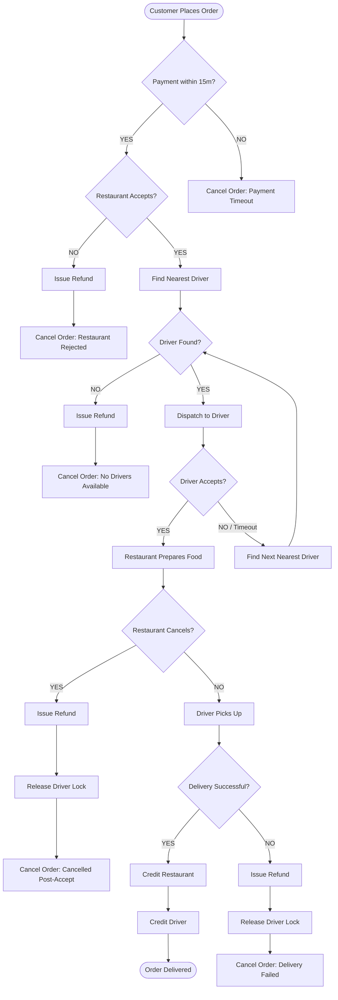
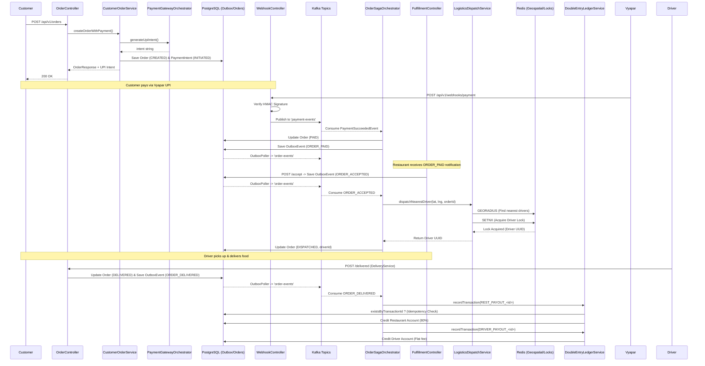
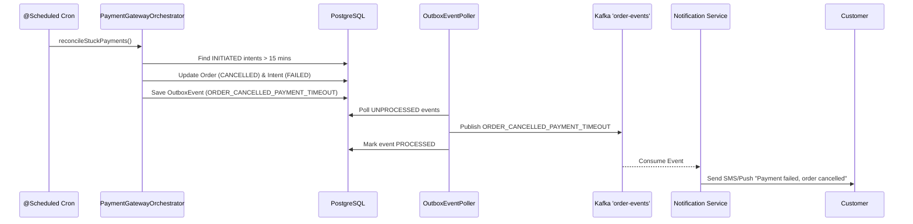
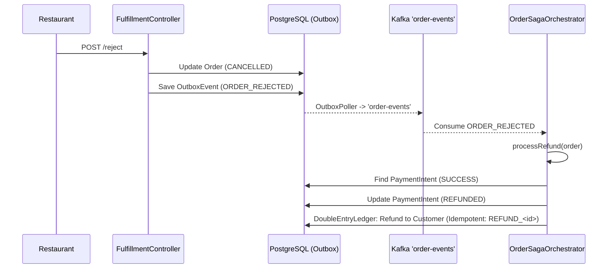
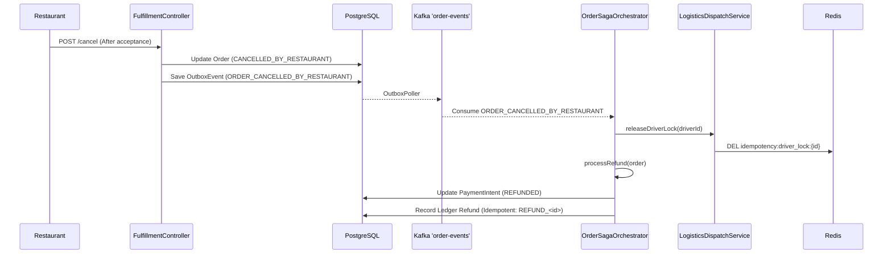
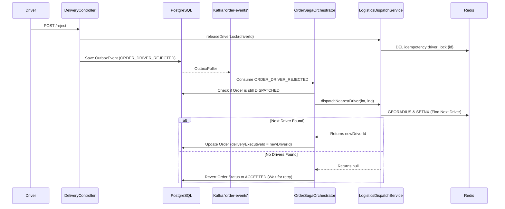
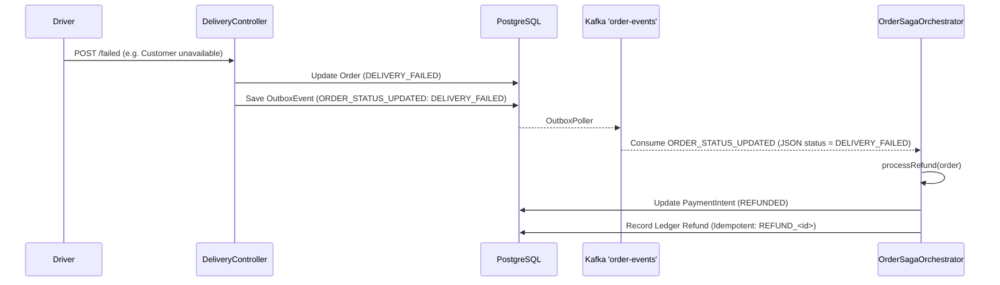
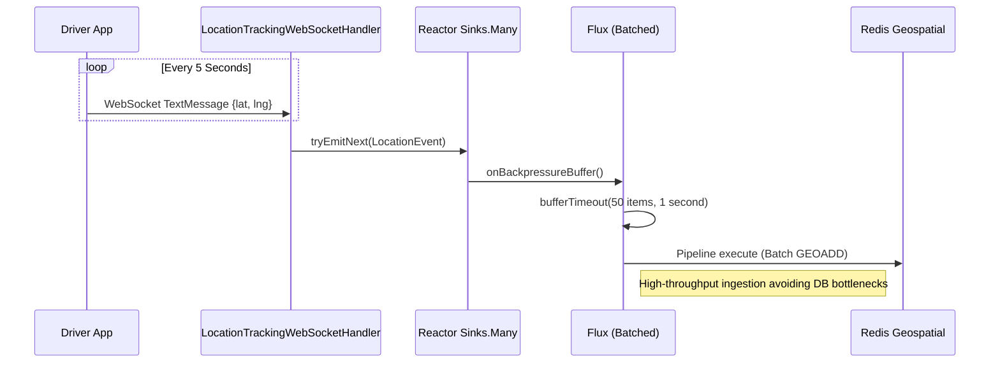
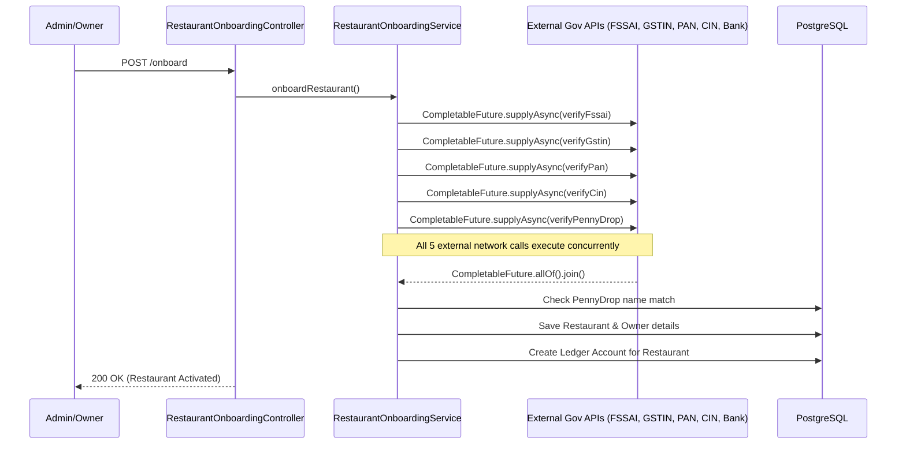

# Food Delivery Modular Monolith

This repository contains the backend for the Food Delivery application, built as a highly cohesive Modular Monolith. The architecture focuses on domain-driven design, decoupling internal domains while keeping the deployment model simple as a single deployable artifact.

## Technologies Used
- Java 21
- Spring Boot 3.3.0
- PostgreSQL (Primary transactional database)
- Redis (Geospatial indexing and distributed locks)
- Flyway (Database migrations)
- Maven (Build tool)
- Docker & Docker Compose (Local environment setup)

## Core Domains
The application is structured into domain modules under `com.fooddelivery`:
- **`common`**: Shared infrastructure, exception handling, custom filters (Idempotency, Request Caching), and API Response structures.
- **`customer`**: Handles authentication, restaurant discovery (PostGIS radius search), and cart/order initiation.
- **`restaurant`**: Manages KYB onboarding (mocked verification), catalogs, and fulfillment lifecycle (`ACCEPTED`, `READY_FOR_PICKUP`).
- **`delivery`**: Driver onboarding, fleet management, logistics dispatching, and real-time WebSocket telemetry for tracking.
- **`order`**: Core orchestrator utilizing the Saga pattern to manage distributed transactions between payments, fulfillment, and logistics. Contains the Ledger service for immutable double-entry accounting.

## Advanced Patterns Implemented
1. **Saga Orchestration**: Orders progress through complex states via `OrderSagaOrchestrator` using a robust event-driven approach.
2. **Transactional Outbox**: Events emitted by domains are stored in the database transactionally alongside state changes, preventing dual-write issues.
3. **Optimistic Locking**: The `LedgerService` ensures atomic credit/debit operations using `@Version` fields on accounts.
4. **Distributed Redis Locks**: `LogisticsDispatchService` implements atomic locking to prevent multiple orders from being assigned to the same delivery executive simultaneously, using `opsForValue().setIfAbsent` and proper lock release lifecycles on delivery completion, cancellation or timeouts.
5. **Idempotency**: Critical endpoints are protected against replay attacks and duplicate requests using an `IdempotencyFilter`.
6. **Strict Kafka Exception Handling**: Listener methods deliberately rethrow exceptions instead of swallowing them, ensuring the Kafka container handles retries and dead-letter queues properly without dropping messages.
7. **Strict Transaction Boundaries**: Resolved AOP proxy bypass issues by inlining self-invoked transactional methods or ensuring they are routed through the proxy, ensuring atomic commits across the system.

# Comprehensive System Flow Diagrams

This document contains detailed sequence diagrams for every major scenario within the Food Delivery Application backend.


## Order Saga Decision Flowchart



## 1. Happy Path: E2E Order to Delivery Flow



## 2. Order Cancellation: Payment Timeout (Cron Job)



## 3. Restaurant Rejection & Refund Flow



## 4. Restaurant Cancellation Post-Acceptance



## 5. Driver Rejection & Redispatch Flow



## 6. Delivery Failed Flow



## 7. Reactive Delivery Telemetry Ingestion (WebSockets)



## 8. Parallelized Restaurant Onboarding Flow




## Testing
Comprehensive end-to-end testing scripts are provided in the `tests/` directory to simulate complete user journeys, error handling, and theoretical edge cases.

To run the complete test suite:
```bash
./test_all.sh
```

Tests include validations for:
- Happy Path (End to End order creation to delivery)
- Idempotency Validation (Preventing duplicate orders)
- Webhook Authentication (Vyapar HMAC validation)
- Negative Edge Cases (e.g., Driver rejections, Driver Ping timeouts, Driver Delivery Failures, and Restaurant Post-Acceptance Cancellations).

**Note on Testing/Onboarding**: 
- The `test_all.sh` script automatically flushes the Redis store (`DRIVER_LOCATION_KEY`) before running the suite to prevent cross-test driver assignment pollution. 
- When manually hitting endpoints or creating test scripts, be aware that `RestaurantOnboardingService` mandates a "Penny Drop" mock verification. The fields `bankAccountNumber` and `ifscCode` are REQUIRED in the JSON payload to successfully onboard a restaurant (otherwise `400 Bad Request` is returned).

## Getting Started
Ensure Docker is running, then use the provided script to start the local environment (Postgres and Redis):
```bash
docker-compose up -d
```
Then start the application:
```bash
./mvnw spring-boot:run
```
