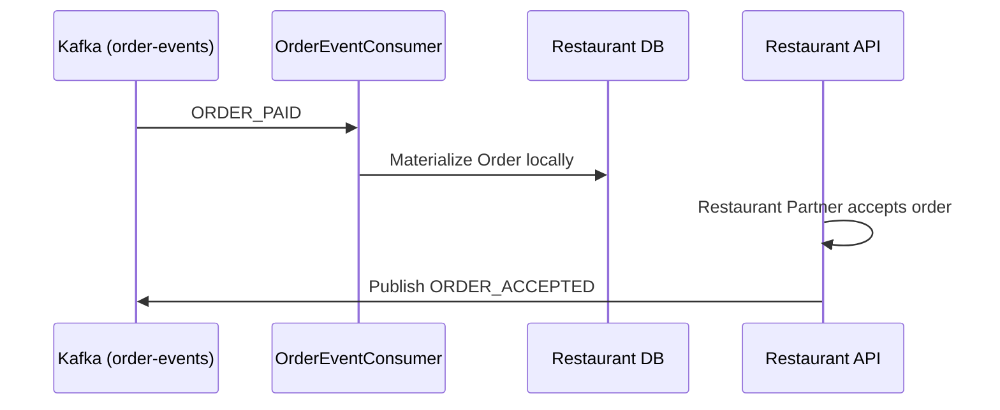

# Restaurant Application

The Restaurant Application provides the backend API for restaurant partners. It allows restaurants to manage their menus, configure availability, and accept or reject incoming orders.

## Responsibilities

1. **Menu Management**: CRUD operations for `restaurants` and `menu_items`.
2. **Order Lifecycle**: Consumes `ORDER_PAID` events from Kafka (emitted by CustomerApplication) and presents them to the restaurant dashboard.
3. **Acceptance Events**: When a restaurant manually accepts an order, it publishes an `ORDER_ACCEPTED` event back to Kafka to inform the Customer and Delivery applications.

## Flow Diagram

## Setup

Requires PostgreSQL (`restaurant_db`) and Kafka. Run `mvn spring-boot:run`.
