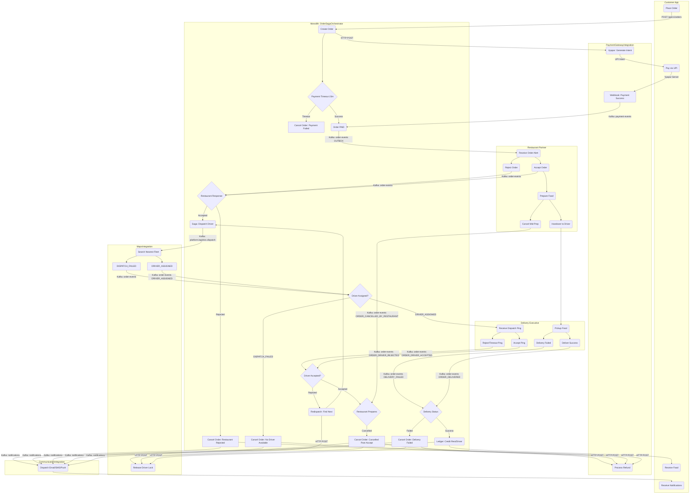
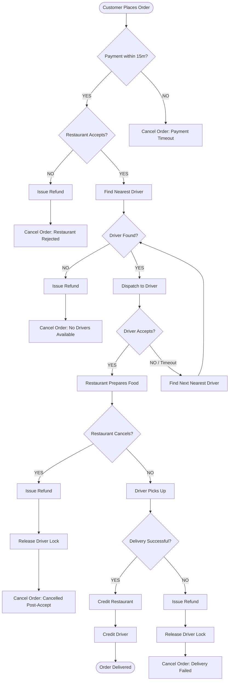
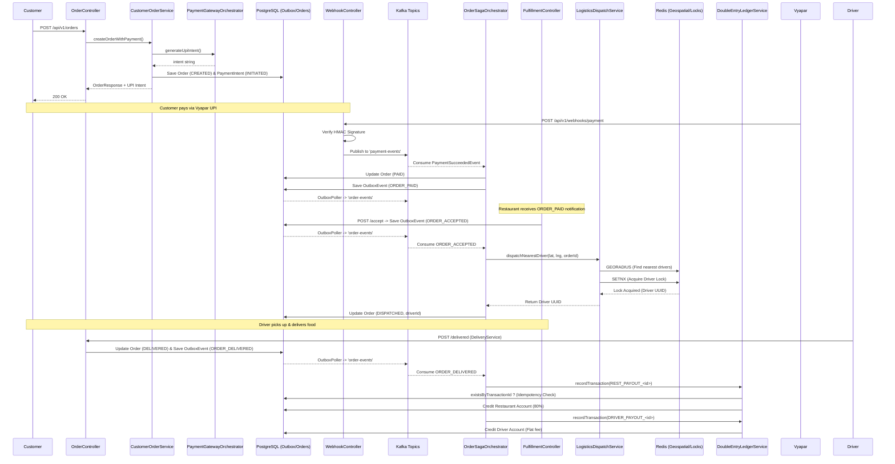
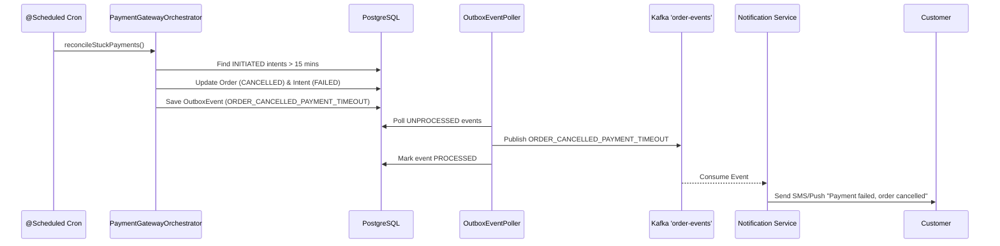
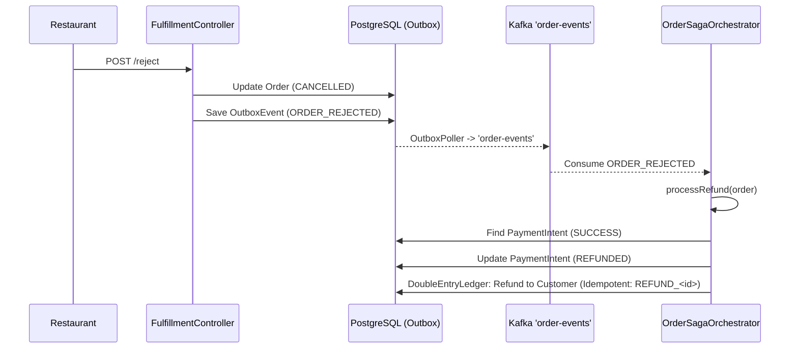
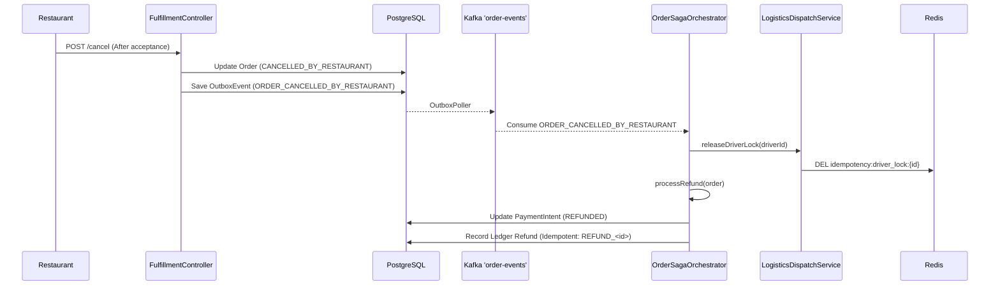
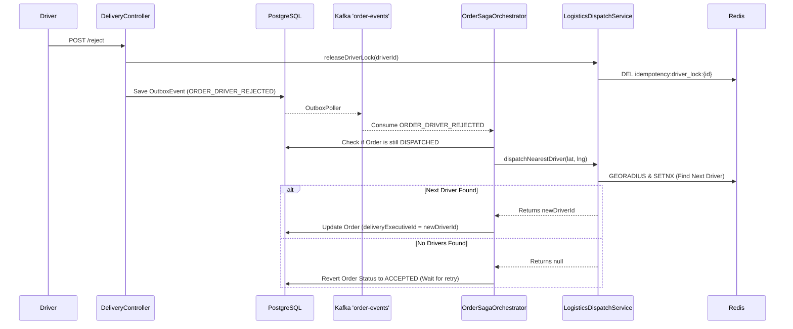
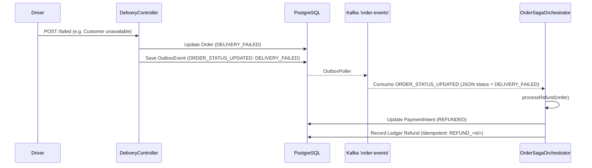
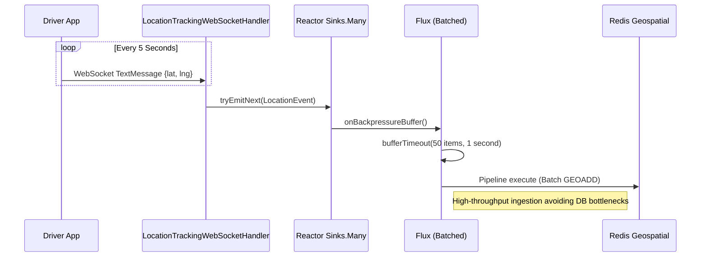
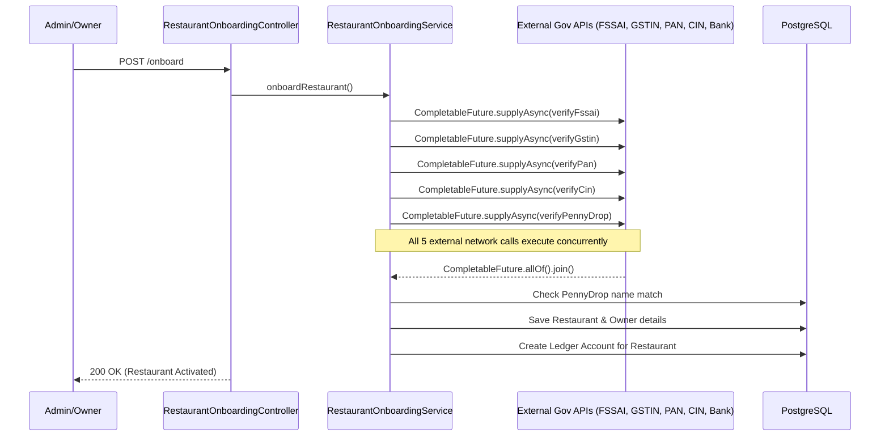

# Comprehensive System Flow Diagrams

This document contains detailed sequence diagrams for every major scenario within the Food Delivery Application backend.

## Comprehensive Cross-Service Orchestration Map

## Order Saga Decision Flowchart

## 1. Happy Path: E2E Order to Delivery Flow

## 2. Order Cancellation: Payment Timeout (Cron Job)

## 3. Restaurant Rejection & Refund Flow

## 4. Restaurant Cancellation Post-Acceptance

## 5. Driver Rejection & Redispatch Flow

## 6. Delivery Failed Flow

## 7. Reactive Delivery Telemetry Ingestion (WebSockets)

## 8. Parallelized Restaurant Onboarding Flow

