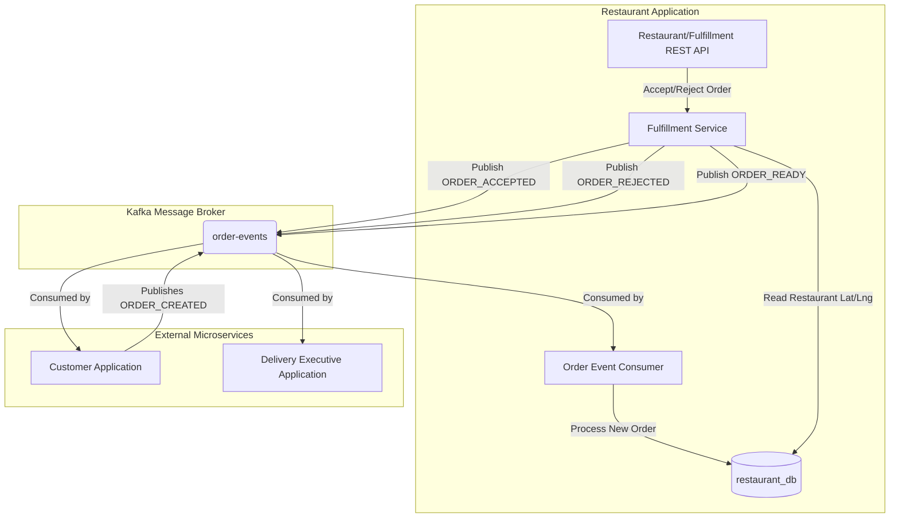
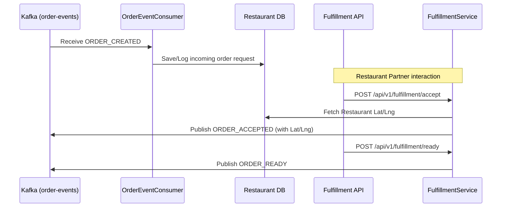

# Restaurant Application - System Flow Diagrams

This document illustrates the event-driven architecture and sequence flows of the `RestaurantApplication`, which manages the menu catalog and order fulfillment lifecycle for restaurant partners.

## High-Level Event Architecture

## Order Fulfillment Sequence

